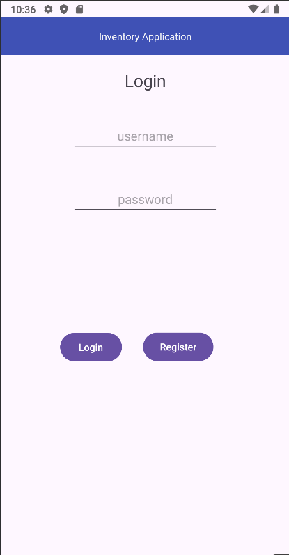
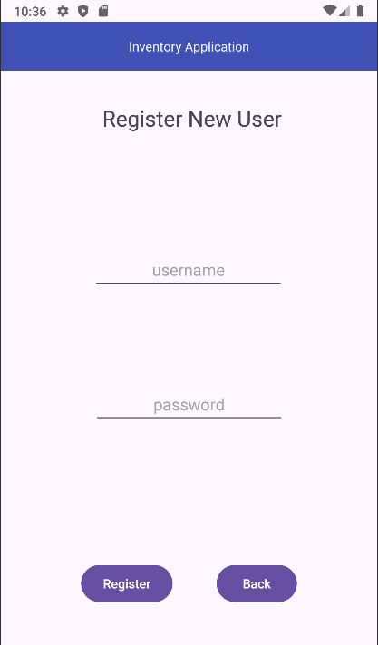

<h1> CS-360-Project-3</h1>
<h2 align='center'> Jesse Draper</h2>

SNHU

 

 

## Description
This project was designed to implement knowledge regarding Android Studio. Learning layout formatting as well as implementing methodology into a fullstack android application. SQlite packages allow us to generate a database with tables for accessing the users and inventory in the database. We can also allow permissions for SMS notificatinos to notify users of low inventory quantity. This was the first fullstack experience I have had in this IDE and OOP language so it was fun to learn how to implement what I have learned in this course.
 

 

## Usage
To use this application you will need to download Android Studio and use the pie release in order to mirror the sdk of the program. The application requires no other outside packages and can virtually be deployed via android studio. 

## Collaborators
Jesse Draper (Myself)

